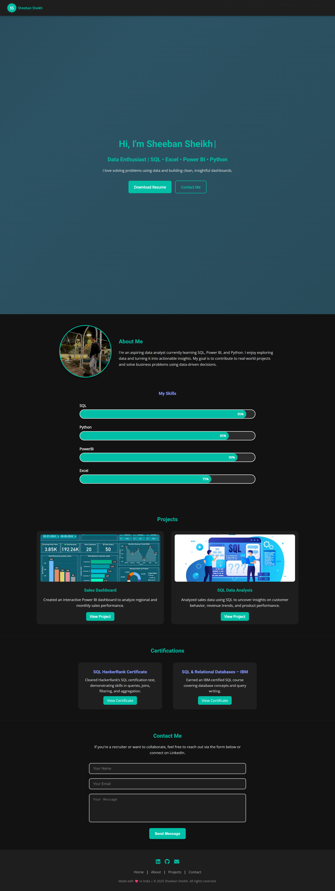

##** 📷 Sheeban Sheikh | Data Analyst Portfolio**

Welcome to my personal data analyst portfolio website. This site highlights my skills, projects, certifications, and professional journey in the world of data analysis.
---

🔗 **Live Website:** [sheeban-portfolio.netlify.app](https://sheeban-portfolio.netlify.app/)  
---

## 📸 Preview

---

## 📂 Sections Covered

- **Home**: Intro + tagline with typing animation
- **About Me**: Bio, profile image with fullscreen preview, structured skill bars
- **Skills**: Animated and interactive skill progression bars (SQL, Python, Power BI, Excel)
- **Projects**: Interactive project cards with tilt, glow, and thumbnails
- **Certifications**: Verified certificates with links
- **Contact**: Responsive form with email integration using Formspree
- **Footer**: Social icons, copyright

---

## 💡 Features

- Responsive mobile-first layout
- Scroll progress bar
- Navbar with scroll-shrink and hamburger menu
- Back-to-top button
- Glowing hover effects
- Typing animation
- Profile image flip + zoom preview
- Animated skill bars with glow on hover
- Netlify-hosted

---

## 🛠️ Tech Stack

- HTML5, CSS3, JavaScript (Vanilla)
- Responsive design using Flexbox and Media Queries
- Formspree integration for contact form
- [Vanilla Tilt.js](https://micku7zu.github.io/vanilla-tilt.js/) for card effects

---

## 📜 License

This portfolio is open-source for learning and inspiration.  
**Please do not copy or reuse content or design without permission.**

---

## 🙋‍♂️ Connect with Me

- [LinkedIn](https://www.linkedin.com/in/sheeban-sheikh-3598b12b7)
- [GitHub](https://github.com/sheeban-sheikh)
- 📬 Email: work.sheeban@gmail.com
**
